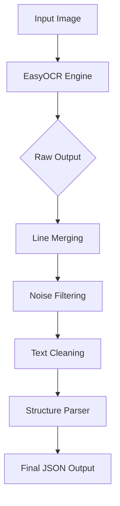

# 🧠 OCR Algorithm & Logic Explanation

This document explains the core algorithms used in the Vietnamese CCCD OCR system.

## 1. Core Engine: EasyOCR
We use **EasyOCR** as the backbone for text detection and recognition.

-   **Why EasyOCR?**
    -   It uses a deep learning approach (CRAFT for detection + CRNN/ResNet for recognition).
    -   It has built-in support for **Vietnamese** (handling accents/diacritics much better than Tesseract).
    -   It is robust against noisy backgrounds and rotated text.

-   **Configuration:**
    -   `languages=['vi', 'en']`: We load both Vietnamese and English models. English is crucial for accurately reading numbers (ID, Date) and mixed content.
    -   `gpu=False`: Configured for CPU usage (can be enabled if CUDA is available).

## 2. Post-Processing Pipeline (`ocr/post_process.py`)
Raw OCR output is often fragmented (e.g., "CỘNG" "HÒA" "XÃ" "HỘI" as separate boxes). We implement a custom pipeline to fix this.

### A. Line Merging Algorithm
**Goal:** Combine fragmented words into complete lines (e.g., "CỘNG HÒA XÃ HỘI CHỦ NGHĨA VIỆT NAM").

**Logic:**
1.  **Sort Boxes:** First by Y-coordinate (top-to-bottom), then by X-coordinate (left-to-right).
2.  **Iterate & Group:**
    -   We compare the current box with the last box in the current line.
    -   **Vertical Check:** If `abs(y_center1 - y_center2) < 15px`, they are on the same line.
    -   **Horizontal Check:** If `x_gap < 60px`, they are close enough to be part of the same sentence.
    -   **Merge:** If both conditions are met, we group them.
3.  **Result:** A list of merged lines with updated bounding boxes.

### B. Text Cleaning (Regex)
**Goal:** Fix common OCR errors specific to Vietnamese CCCD.

-   **Label Correction:**
    -   `sa.` or `So:` $\rightarrow$ `Số:`
-   **Number/Letter Confusion:**
    -   `199C` $\rightarrow$ `1990` (Common error where '0' is read as 'C')
    -   `O9` $\rightarrow$ `09` (Letter 'O' read as number '0')
    -   `l9` $\rightarrow$ `19` (Letter 'l' read as number '1')

### C. Structured Parsing
**Goal:** Extract specific fields (Name, ID, DOB) from the unstructured text lines.

We iterate through the merged lines and look for keywords:
-   **ID Number:** Look for 12-digit patterns (`^\d{12}$`) or lines containing "Số:".
-   **Name:** Look for lines after "Họ và tên" or "Tên".
-   **DOB:** Look for date patterns (`DD/MM/YYYY`) near "Ngày sinh".
-   **Expiry:** Look for date patterns near "Có giá trị đến".

## 3. Architecture Overview

